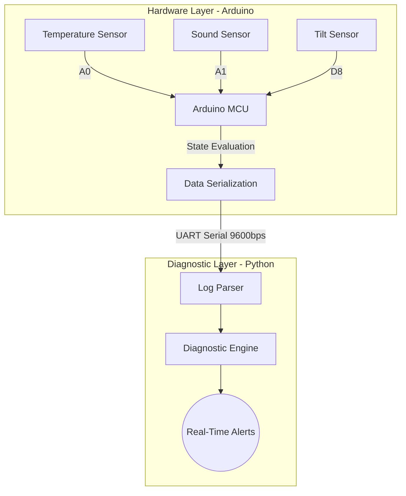

<div align="center">
  <h1>🚀 Embedded Telemetry & Diagnostic Platform</h1>
  <p><i>A real-time observability system for embedded hardware, combining microcontroller telemetry with AI-ready Python diagnostics.</i></p>

  [](https://www.arduino.cc/)
  [](https://www.python.org/)
  [](LICENSE)
  [](https://github.com/HariniKartheeswaran/Embedded-Telemetry-Diagnostic-Platform/actions/workflows/build.yaml)
</div>

<hr/>

## 📖 Table of Contents
- [Overview](#-overview)
- [System Architecture](#-system-architecture)
- [Key Features](#-key-features)
- [Hardware Requirements](#-hardware-requirements)
- [Wiring Guide](#-wiring-guide)
- [Software Setup](#-software-setup)
- [Usage Guide](#-usage-guide)
- [Data Protocol](#-data-protocol)
- [Future Roadmap](#-future-roadmap)

## 🌌 Overview
The **Embedded Telemetry & Diagnostic Platform** is a robust, end-to-end observability solution that seamlessly bridges the gap between raw hardware sensors and high-level software analysis. 

By leveraging an Arduino microcontroller for real-time data acquisition and a Python-based diagnostic engine, this project continuously monitors environmental variables (temperature, sound, and orientation) and performs immediate anomaly detection. It serves as a foundational framework for IoT sensor fusion, condition monitoring, and edge-to-cloud telemetry.

## 🏗 System Architecture



## ✨ Key Features
- **Multi-Sensor Data Fusion:** Simultaneously aggregates data from analog and digital sensors.
- **Edge State Detection:** The firmware pre-processes raw signals to determine the system's immediate state before transmission.
- **Lightweight Telemetry Protocol:** Custom key-value serialization designed for low-bandwidth UART communication.
- **Real-Time Python Diagnostics:** An extensible `analyser.py` engine that interprets the hardware logs and translates them into actionable alerts.
- **Fault Tolerance:** Robust log parsing in Python gracefully handles dropped packets or corrupted serial frames.

## 🛠 Hardware Requirements
- **Microcontroller:** Arduino Uno (or compatible board)
- **Communication:** Bluetooth Module (e.g., HC-05 / HC-06)
- **Sensors:**
  - Analog Temperature Sensor (e.g., LM35, TMP36, or NTC Thermistor)
  - Analog Sound/Microphone Sensor
  - Digital Tilt / Shock Sensor (e.g., SW-520D or mercury switch)
- Jumper wires & Breadboard

## 🔌 Wiring Guide

### 2.1 Sensor Wiring

| Component | VCC | GND | OUT/Data |
| :--- | :---: | :---: | :---: |
| **Temperature Sensor** | `5V` | `GND` | `A0` |
| **Sound Sensor** | `5V` | `GND` | `A1` |
| **Tilt / Shock Sensor** | `5V` | `GND` | `D8` |

### 🔵 2.2 Bluetooth Wiring

| Bluetooth Module | Arduino |
| :--- | :--- |
| `VCC` | `5V` |
| `GND` | `GND` |
| `TX` | `D0 (RX)` |
| `RX` | `D1 (TX)` |

> [!WARNING]
> **IMPORTANT RULE:** Disconnect the `TX` and `RX` pins while uploading code to the Arduino!

## 💻 Software Setup

### 1. Firmware (Arduino)
1. Open `firmware/main.ino` in the [Arduino IDE](https://www.arduino.cc/en/software).
2. Connect your Arduino board via USB.
3. Select your appropriate Board and COM Port from the `Tools` menu.
4. Compile and Upload the firmware to the microcontroller.

### 2. Diagnostic Engine (Python)
Ensure you have Python 3.7+ installed.

1. Navigate to the `analyser` directory:
   ```bash
   cd analyser
   ```
2. Install the required dependencies:
   ```bash
   pip install pyserial
   ```
3. **Important Configuration:** Open `analyser.py` and modify the COM port to match your Arduino's assigned port:
   ```python
   # 🔴 CHANGE THIS PORT
   ser = serial.Serial('COM4', 9600)  # Change 'COM4' to e.g., '/dev/ttyUSB0' on Linux
   ```

## 🚀 Usage Guide
Once the firmware is running and the Python environment is set up, start the diagnostic engine:

```bash
python analyser.py
```

### Example Output
```text
Listening to real-time data...

TEMP:320,SOUND:150,TILT:0,STATE:NORMAL => System stable
TEMP:600,SOUND:200,TILT:0,STATE:TEMP_HIGH => Overheating → Check environment
TEMP:325,SOUND:450,TILT:0,STATE:NOISE_ALERT => Noise spike → Possible disturbance
TEMP:310,SOUND:120,TILT:1,STATE:TILT_ALERT => Instability → Check placement
```

## 📡 Data Protocol
The system uses a lightweight, comma-separated key-value protocol over UART (9600 baud rate, 8N1):
`KEY1:VALUE1,KEY2:VALUE2,...`

Currently defined keys:
- `TEMP`: Integer representing raw analog reading of the temperature.
- `SOUND`: Integer representing raw analog reading of ambient noise.
- `TILT`: Boolean-like integer (`0` or `1`) representing orientation.
- `STATE`: String enumerator evaluated by the edge device (`NORMAL`, `TEMP_HIGH`, `NOISE_ALERT`, `TILT_ALERT`).

## 🔮 Future Roadmap
- [ ] **AI-Based Diagnostics:** Integrate scikit-learn to replace hardcoded thresholds with anomaly detection algorithms.
- [ ] **Data Logging & Visualisation:** Add a Grafana dashboard and SQLite integration to store and plot historical sensor data.
- [/] **CI/CD Pipeline Integration:** Firmware compilation automated via GitHub Actions (Linting pending).
- [ ] **IoT Cloud Sync:** Publish diagnostic states to an MQTT broker for remote monitoring.